# Livd

**Know what it's really like to live there.**

Livd is a property intelligence platform. It collects what people who actually
lived at a property say about it — including why they left — and turns that into
something a prospective renter can make a decision with.

**[Live site](https://livd.site)** · [Product spec](docs/product-spec.md) · [Architecture](docs/architecture.md) · [Design system](docs/design-system.md)

> The deployed site runs on seeded demonstration data. Every seeded property is
> labelled **Sample data** wherever it appears, excluded from the sitemap, and
> marked `noindex`. No real resident has reviewed anything on Livd yet.

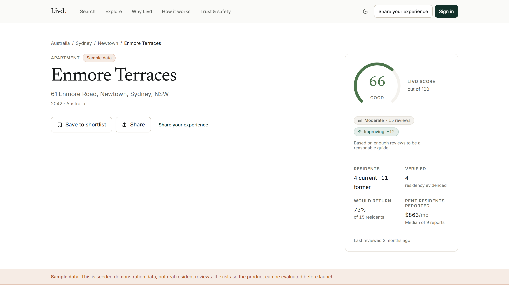

| | |
| --- | --- |
| **What** | A property intelligence platform built on structured accounts from people who have already lived somewhere — including why they left |
| **For** | Renters deciding where to live, and former residents contributing the record |
| **My role** | Solo. Product, design system, interface, frontend, database, trust and safety, deployment |
| **Built with** | Next.js 16 · React 19 · TypeScript · PostgreSQL via Supabase · Tailwind v4 · no ORM, no component library |
| **Scale** | <!--count:tables-->41<!--/count--> tables · <!--count:policies-->75<!--/count--> RLS policies · <!--count:dbFunctions-->105<!--/count--> database functions · <!--count:tests-->1,000<!--/count--> tests · 12 markets |
| **State** | Deployed and working end to end, on seeded data. Not launched — no real reviews yet |

---

## The problem

A renter can see the property, meet the landlord, look at the photographs and
walk the neighbourhood. What they cannot discover is what the previous residents
experienced — the things that only reveal themselves after three months of
living there.

That information exists. It is held by people who have already moved out, and
nothing collects it in a form the next renter can use.

Livd is built on the premise that the most valuable thing a former resident
knows is **why they left**, and that it is worth capturing as structured data
rather than as prose nobody can count.

| Livd is not | Because |
| --- | --- |
| A listings marketplace | It never brokers a rental. No inventory, no commissions, no incentive to flatter a property. |
| A landlord directory | Reviews are about buildings and the experience of living in them, not about individuals. |
| "Yelp for apartments" | A five-star average is not intelligence. Livd produces structured answers to specific questions. |
| A regional product | Twelve markets across five continents are configuration, not special cases. |

---

## What it looks like

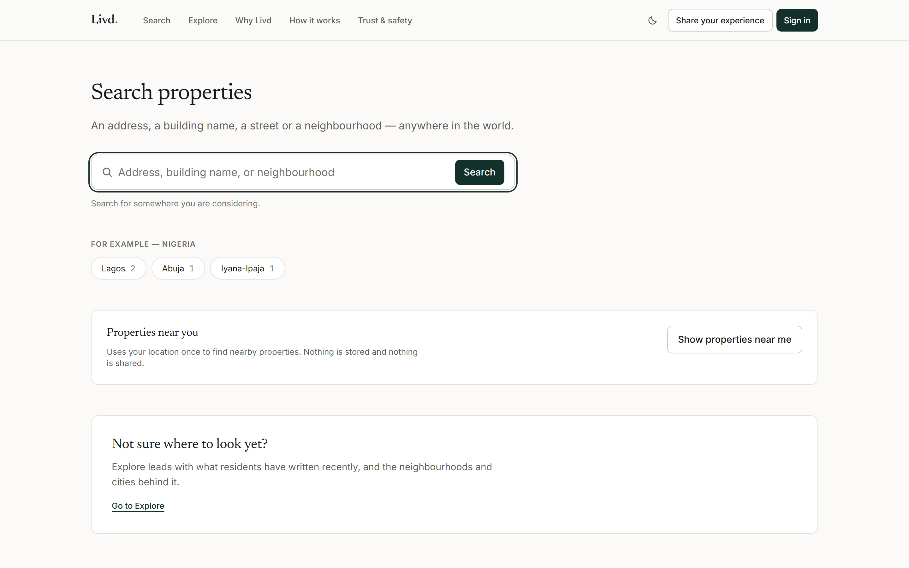

Search results carry the score, the confidence band, the direction of travel and
the two or three categories residents rated most sharply — enough to decide what
to open, without opening it.

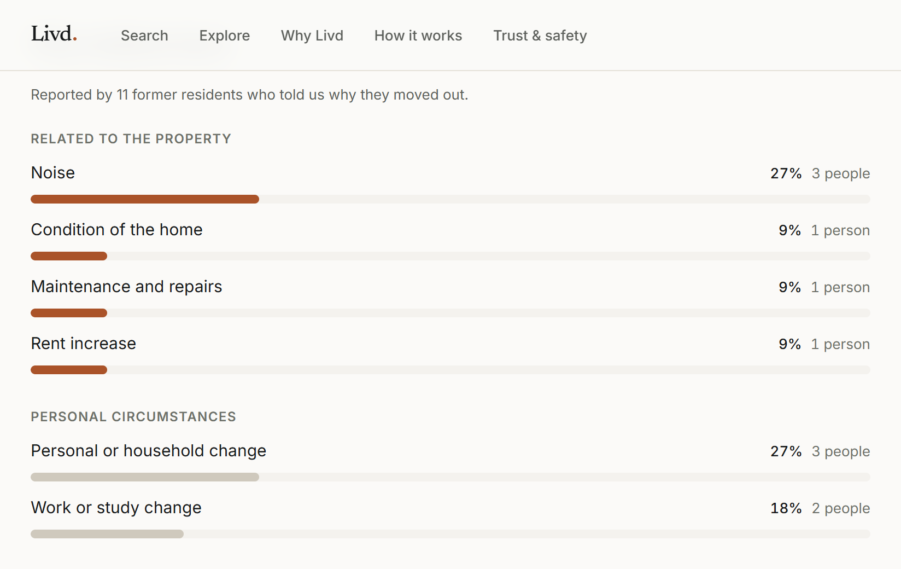

The signature section. Departure reasons are captured as structured data at
move-out, then counted across a property's whole history. Reasons that reflect
on the building are separated from reasons that do not, because "the rent went
up" and "I got a job in another city" are not the same finding.

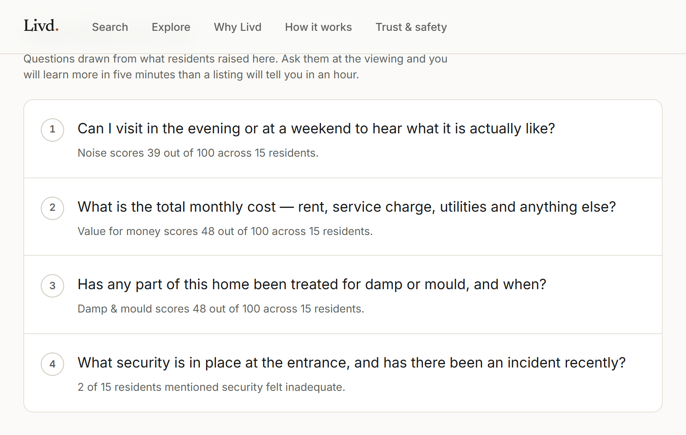

The property's weakest categories, converted into questions a renter can
literally ask at the viewing. Every question states the evidence it came from.

<table>
<tr>
<td width="42%" align="center">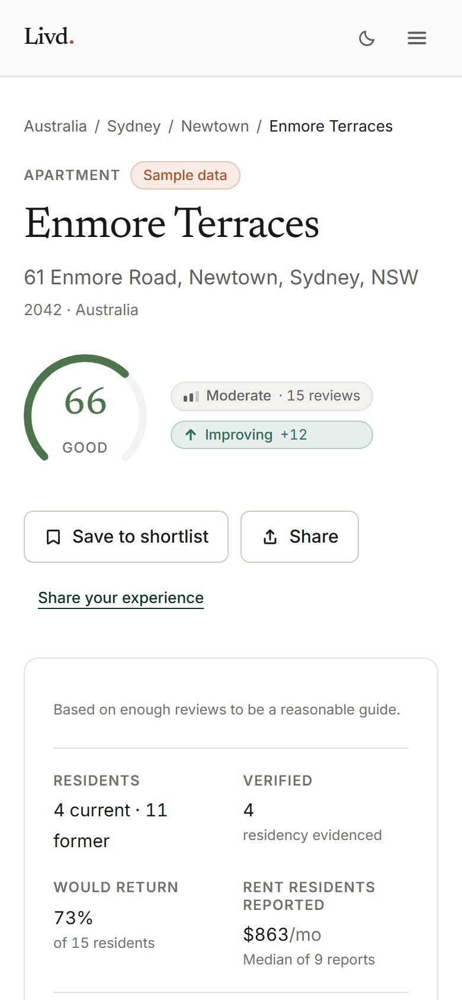</td>
<td width="58%">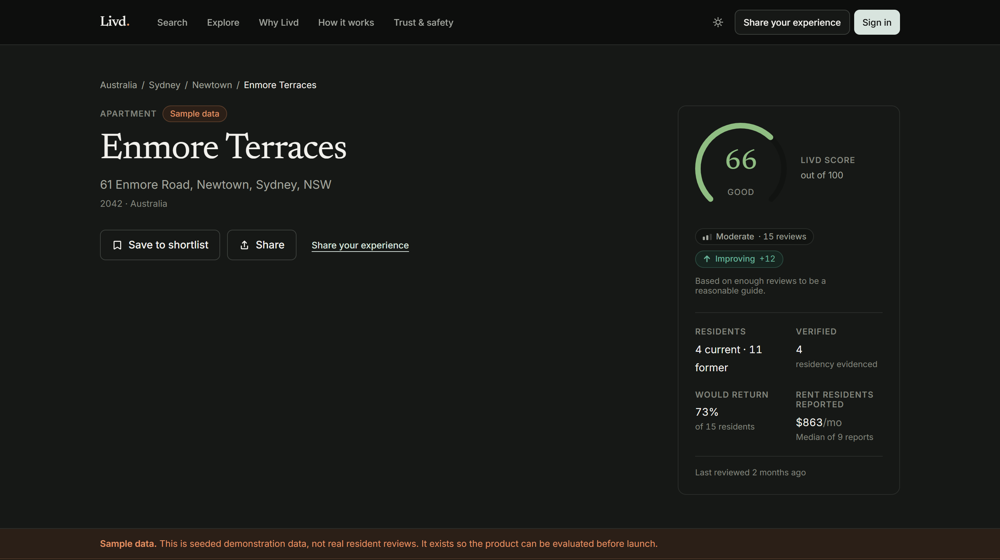</td>
</tr>
<tr>
<td>Mobile is designed, not scaled down — the score dial moves inline with the header, filters become a bottom sheet, the review wizard becomes one full-height step per decision.</td>
<td>Dark mode is a full token remap rather than an inversion, and the palette is asserted pair by pair in <a href="tests/design/contrast.test.ts"><code>tests/design/contrast.test.ts</code></a>.</td>
</tr>
</table>

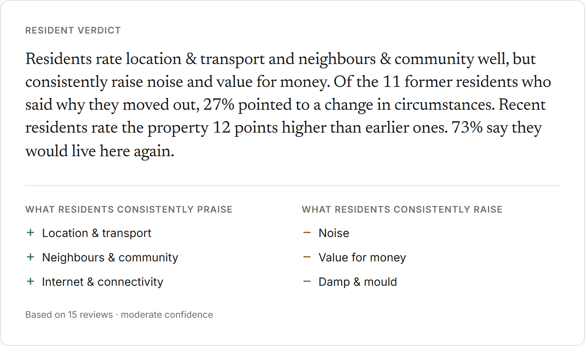

Prose that reads as though it were written, assembled deterministically from
aggregates that have already cleared their own disclosure thresholds. It has no
access to anything but counts and scores, so it cannot state something residents
did not report — and it says what it rests on: *based on 15 reviews, moderate
confidence*. [`VerdictGenerator`](src/lib/intelligence/verdict.ts) is the seam
where a language model could be substituted later, and the reason one would
still be unable to invent anything.

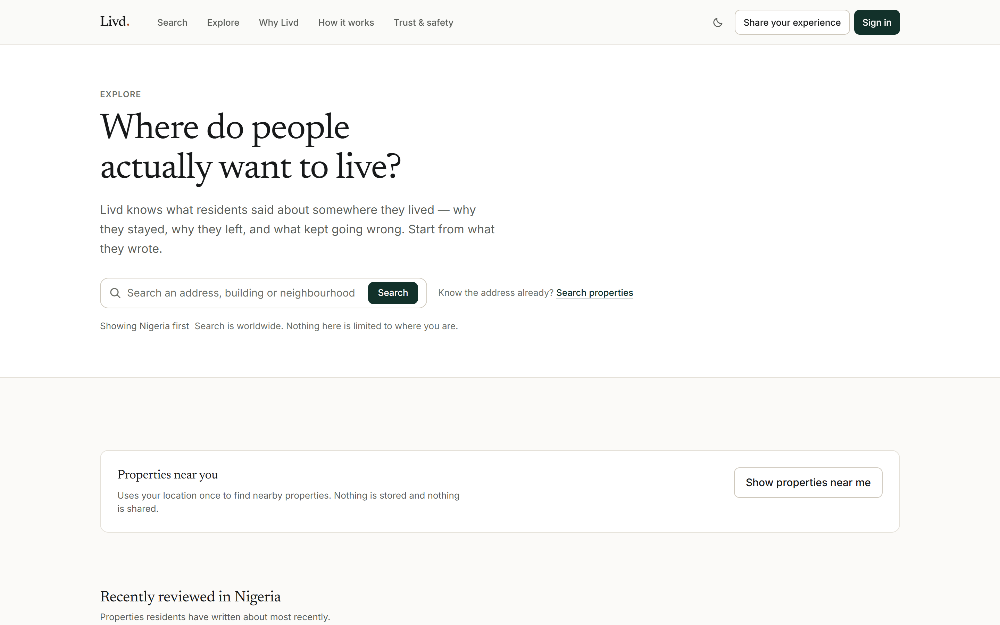

Explore is the surface for people who do not yet have an address in mind. It
orders by where the reader is without limiting what they can reach, and says so
in as many words: *"Search is worldwide. Nothing here is limited to where you
are."* Below it, neighbourhood-level discovery, and a nearby control that asks
for a location only once somebody presses it.

More screens in [`docs/images/`](docs/images) — category scores, the freshness
panel, the timeline, typo tolerance in search, the empty states, the Trust &
Safety console, and the audit trail.

---

## The product decisions

Livd is defined less by what it does than by what it refuses to do. Each refusal
below is a design decision with a mechanism behind it, not a policy in a
document.

### A score is never shown without its basis

Below a threshold of evidence, no score is published at all and the page says
what it does not know.

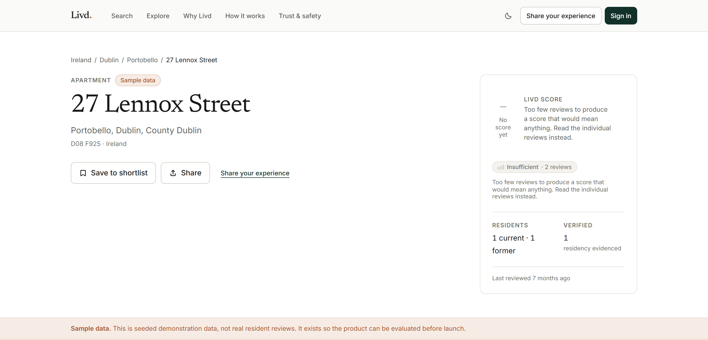

The Livd Score is a computed judgement on a 0–100 scale — deliberately not five
stars, so it cannot be mistaken for a consumer star average. Four adjustments,
in order: a weighted category aggregate, recency decay, verification weighting,
then Bayesian shrinkage toward a neutral prior so three glowing reviews cannot
produce a 98. Effective sample size determines the confidence band, and below
`limited` there is no number.

*Enforced in [`src/lib/intelligence/scoring.ts`](src/lib/intelligence/scoring.ts) — pure functions, no I/O, the most heavily tested file in the repository. Every constant carries the reasoning for its value.*

### "Why residents leave" stays hidden below four responses

One person's reason rendered as "100%" is both meaningless and potentially
identifying. Four is where a distribution starts to describe a building rather
than a person.

*Enforced in [`src/lib/intelligence/departures.ts`](src/lib/intelligence/departures.ts).*

### Reviews are about properties, not people

Contact details, unit numbers and named individuals are refused before
publication — with a specific instruction saying what to change and why, rather
than a generic rejection.

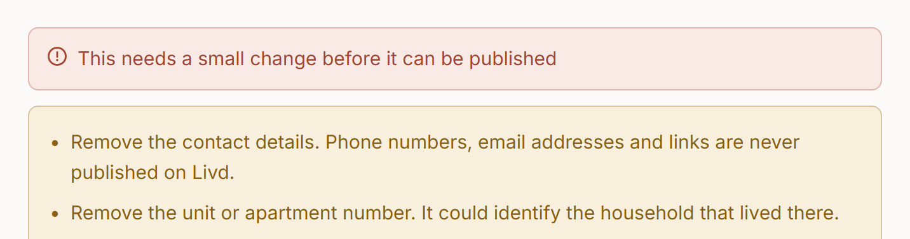

*Enforced in [`src/lib/safety/content-linter.ts`](src/lib/safety/content-linter.ts), called by the submit action before anything is persisted.*

### Verification is a signal, not a gate — and it stores no location

A resident can confirm they are at a property before writing, and the review
carries "Location verified". That is the honest claim: being at a building is
evidence of presence, not of a tenancy, and the product never says otherwise.

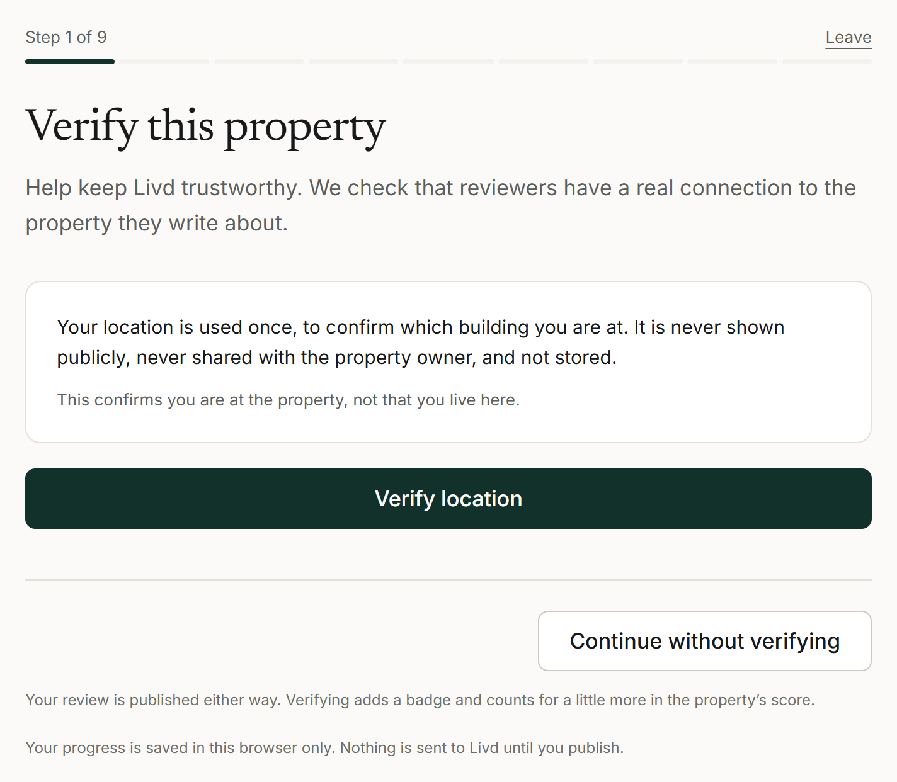

The privacy explanation appears **before** the permission prompt, not after it.
A review published without verifying is still published, still counted and still
permanent; verification changes how much weight it carries, not whether it
exists.

The position itself is used for one comparison and never stored.
`property_verifications` has no latitude, longitude, accuracy or distance
column, so there is no location history in the database to leak, subpoena or
lose.

*Decided inside Postgres by `livd_verify_property_location` ([migration 0014](supabase/migrations/0014_property_verification.sql)), so a client can ask for a verdict and never assert one. [`src/lib/geo/proximity.ts`](src/lib/geo/proximity.ts) is the same arithmetic for the local adapter, held to identical constants by [`tests/verification/parity.test.ts`](tests/verification/parity.test.ts).*

### Evidence a machine cannot read is not read by a machine

A resident can also submit a tenancy document for a stronger level. Livd runs no
OCR over it: the file is hashed, stored in a bucket no client role can read, and
shown to a moderator through a signed URL that lives five minutes. The automated
checks work on metadata and on what the database already knows — has this
document been used before, does the claimed tenancy fit the building, is the
submitter the landlord — so the human minute is spent on the judgement rather
than the arithmetic. Nothing in the pipeline grants a level automatically.

*Checks in [`src/lib/safety/verification-checks.ts`](src/lib/safety/verification-checks.ts), adjudicated by a person at `/admin/verification`, schema in [migration 0012](supabase/migrations/0012_verification_pipeline.sql).*

### Recency is part of the answer, and is derived rather than stored

A five-star review from someone who left in 2019 and one from someone who was in
the lobby last week are different claims. The buckets — current, recent, former,
older — are computed on read, so nobody verifies once and stays a "current
resident" for ever.

*Enforced in [`src/lib/intelligence/recency.ts`](src/lib/intelligence/recency.ts).*

### Owners can reply. They cannot remove.

There is no column in the schema and no policy in the database that would let a
property owner alter a review's visibility. It is not a rule that a persistent
request could change — the capability does not exist.

Moderation is on the record too: a review is never deleted, only restatused, and
every decision is written to an append-only log no role can edit.

### A report opens a decision. It does not make one.

A reader's report becomes a **case** — one investigation, however many reports it
gathers — with its own priority, category, assignee and notes.

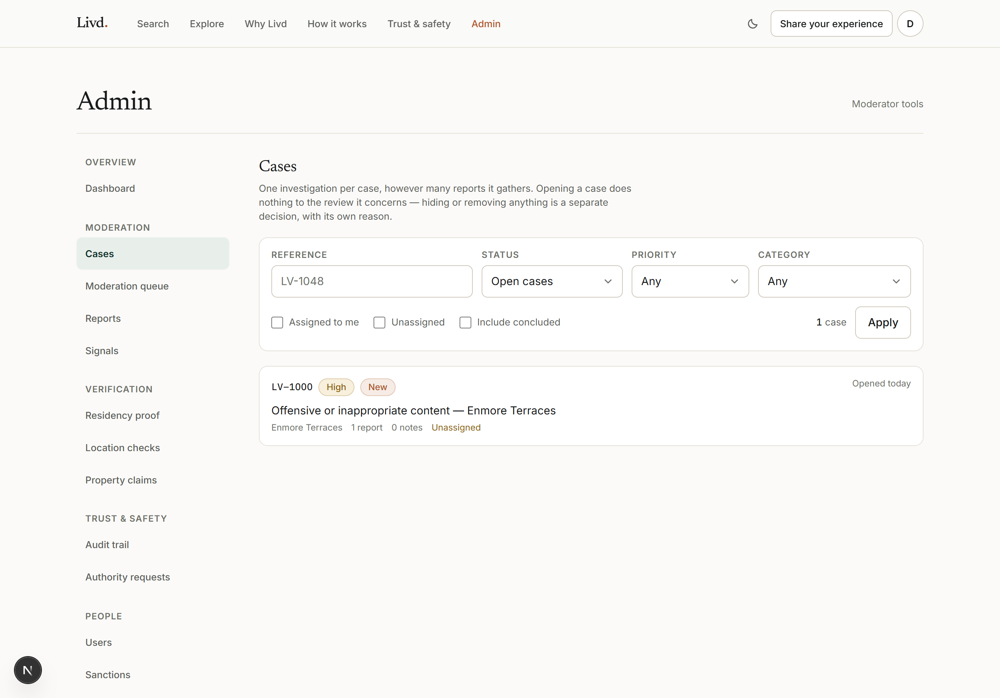

The sentence at the top of that screen is the whole design: *"Opening a case does
nothing to the review it concerns — hiding or removing anything is a separate
decision, with its own reason."* Investigating and acting are deliberately not
the same gesture, because a console where looking into something and taking it
down are one click apart will eventually take down the thing somebody only
looked into.

Around it: evidence preservation holds that stop material being deleted while a
case is open, sanctions against accounts rather than only content, authority
requests logged as disclosure records, and a privileged identity reveal that is
itself audited — who looked at whose information, not only what they decided.

*Enforced across [migrations 0019–0050](supabase/migrations), and attacked as each one landed — see [`docs/security-testing.md`](docs/security-testing.md).*

### Standing is the strongest thing Livd can do to you, so it is said out loud

An account is `active`, `restricted`, `suspended` or `banned`, and the sanction
that changes it is a first-class record with a category, a reason and an expiry
— not a flag somebody flips.

And the account is told. Two messages ignore the email preferences entirely — a
sign-in link, because it is the only way in, and this:


> A decision that removes something you wrote or changes your account's standing
> — a platform that can take your writing down and is under no obligation to
> mention it is not one worth writing for.

There is no newsletter, no digest and no marketing list, so there is nothing on
that page to turn off that nobody asked for.

*Enforced in [`supabase/migrations/0050_standing_and_the_record.sql`](supabase/migrations/0050_standing_and_the_record.sql) and `src/server/notify/`.*

### Deleting an account severs the record rather than erasing it

All three legal pages say a deleted account leaves its reviews standing,
permanently unlinked. The schema said the opposite — `reviews.author_id` was
`on delete cascade`, so deletion would have taken the reviews, their category
ratings and their departure reasons with them. The contradiction was found by
writing the legal briefing, not by writing code.

[Migration 0017](supabase/migrations/0017_account_deletion.sql) severs every
public link instead and destroys everything private with the account — shortlist,
notifications, location checks, evidence files. 0018 exists because 0017 alone
made deletion quietly impossible: a foreign key nulling `author_id` is an
UPDATE, and the trigger that stops authors rewriting reviews refused it. Only a
live test caught that.

### Global from the first commit

Address structure, currency, property-type vocabulary and which review
categories apply are all configuration. A Lagos property is asked about water
supply and never about central heating; a London flat, the reverse. Neither is a
special case in the code.

Twelve markets — US, GB, NG, CA, AU, IE, DE, NL, FR, ZA, AE, IN — with
per-country address templates, per-market property-type labels, and money stored
as `(amount_minor, currency_code)`. There is no default currency symbol anywhere
in the codebase.

---

## What I designed and built

Livd is a solo project. I own every decision in it, and every commit is mine.

**Product.** The positioning, the four user segments, the scope of the MVP and
what was deliberately left out of it. The intelligence layer — what the score is
made of, what each threshold is for, and which questions the product answers
rather than merely displays. Written up in [`docs/product-spec.md`](docs/product-spec.md).

**Design.** The design system — tokens, type scale, palette, motion, responsive
strategy, voice — specified in [`docs/design-system.md`](docs/design-system.md)
and implemented as <!--count:components-->75<!--/count--> components. No component library: a bought design system
is the fastest route to looking like a template. Every user-facing string lives
in one typed file so a second locale is a sibling object rather than a
component change.

**Engineering.** The full application: Next.js App Router, the two-adapter data
layer, the PostgreSQL schema with its RLS policies and database functions, the
verification architecture, the Trust & Safety case system, the notification
catalogue and its delivery path, the test suite, and the deployment — domain,
DNS and mail authentication included.

**Adversarial testing.** I attacked the deployed database as each role and wrote
down what it refused, including the two occasions it refused nothing. That log
is [`docs/security-testing.md`](docs/security-testing.md), and the findings in
it are mine to have made and mine to have found.

**What this is not.** There is no team here, so there is no evidence of
collaboration, and no real users, so there is no adoption data. The seeded
dataset exists to make the product evaluable before launch, and is labelled as
such everywhere it appears.

---

## How it works

Every write passes through four layers, and none of them trusts the one above.

<picture>
  <source media="(prefers-color-scheme: dark)" srcset="docs/images/trust-enforcement-dark.svg">
  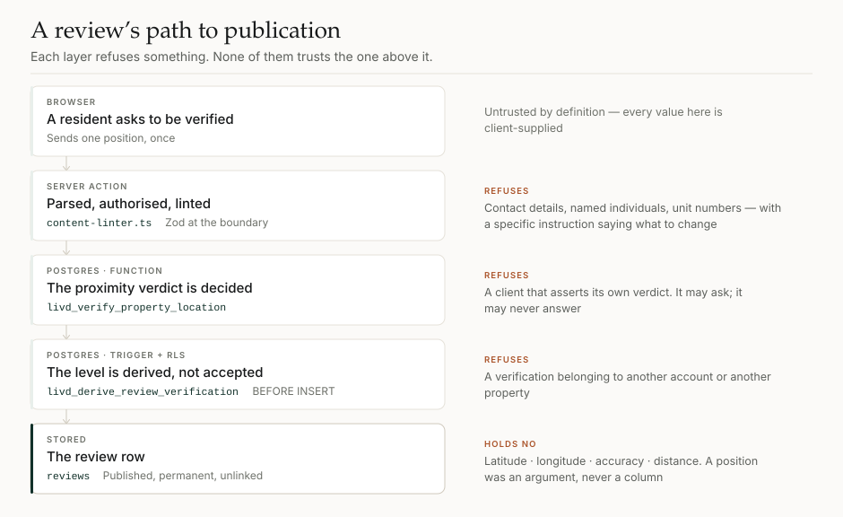
</picture>

**The two-adapter data layer** is the most consequential architectural decision
in the repository. Every read and write goes through one interface,
[`LivdRepository`](src/server/data/repository.ts), and two implementations
satisfy it: a file-backed JSON store for local development, and PostgreSQL
through Supabase in production.

The point is that anyone can clone this repository and see the real product
working — every flow, end to end, writes included — without provisioning
anything. The rule that keeps it honest: the interface is shaped by what
production needs, never narrowed to what the local store finds easy.

| Layer | Choice | Why |
| --- | --- | --- |
| Framework | Next.js 16, App Router | Property pages must be server-rendered and indexable; SEO is the acquisition channel. Server Components keep the intelligence layer off the client bundle. |
| Language | TypeScript, `strict` + `noUncheckedIndexedAccess` | The scoring maths and the safety pipeline are where correctness matters most. |
| UI | React 19 | Server Components, Server Actions, `useActionState` for forms that degrade gracefully. |
| Styling | Tailwind v4 with a CSS-variable token layer | Tokens declared once in `@theme`; arbitrary values are treated as a defect. |
| Database | PostgreSQL via Supabase | Real constraints, Row Level Security, full-text search, `pg_trgm` fuzzy matching, `pg_cron`. |
| Validation | Zod v4 | One schema per boundary, enforced server-side. Client validation is a convenience, never a control. |
| Hosting | Vercel | Rebuilds on every push to `main`. |

**Deliberately not used:** no ORM, no state management library, no component
library, no analytics SDK, no AI at runtime. The Content-Security-Policy permits
`'self'`, the Supabase origin, and — only when a site key is configured —
Cloudflare Turnstile on the two endpoints that create content. Fonts are
self-hosted, so a deployment without bot protection contacts no third party at
all.

**<!--count:tables-->41<!--/count-->** tables · **<!--count:policies-->75<!--/count-->** RLS policies · **<!--count:dbFunctions-->105<!--/count-->** database functions ·
**<!--count:migrations-->50<!--/count-->** migrations · **<!--count:routes-->40<!--/count-->** routes ·
**<!--count:sourceFiles-->212<!--/count-->** source files · **<!--count:testFiles-->60<!--/count-->** test files.

Full detail in [`docs/architecture.md`](docs/architecture.md) and
[`docs/database-schema.md`](docs/database-schema.md).

---

## Evidence

- **<!--count:tests-->1,000<!--/count--> tests** across <!--count:testFiles-->60<!--/count--> files (`npm test`), weighted toward the highest-risk
  code: scoring, the safety linter, rate limiting, burst detection, the
  verification, sanction and account-deletion pipelines, the notification
  catalogue, the colour palette and the international layer.
- **<!--count:securityRuns-->15<!--/count--> recorded runs attacking the live database**, in
  [`docs/security-testing.md`](docs/security-testing.md). Each attack
  impersonates a signed-in browser session by setting the Postgres role and the
  JWT claims PostgREST would set, and runs inside a transaction that is
  deliberately aborted, so no production row is created or changed. It is a log
  rather than a certificate: **two of the runs found real defects**, and both
  are written up under the word they deserve. A moderator could rewrite `profiles.role` on any
  account — *"PERMITTED — 1 row. The escalation was real"* — unexploited only
  because no moderator had been appointed yet. And `reviews.author_id` was
  readable by `anon`, returning a stable author key for all 222 published
  reviews; a UUID is not a name, but a stable per-author key on a public row
  still lets someone group everything one person has written. Both fixed, both
  re-attacked afterwards to prove the fix.
- **No axe-core violations across 36 pages** — every public page signed out,
  and the account area and the whole admin console signed in as an
  administrator. The audit skips a gated page rather than passing it when no
  session is supplied, so the console is not counted clean by accident; it went
  unaudited for exactly that reason until it was fixed. The pages it visits are
  listed in [`scripts/audit-a11y.mjs`](scripts/audit-a11y.mjs).
- **Verification enforcement exercised against the live database** as an
  `authenticated` client, rather than asserted from the policy text: a client
  cannot insert its own verified row, cannot assert `verification_level` on a
  review, cannot use a verification belonging to another account or another
  property, and an approved property manager sees zero verification rows and
  zero reviewer profiles.
- **The served HTML of a property page inspected**, signed out, for coordinates,
  accuracy, distance, verification ids and timestamps, author ids, emails, IP and
  device data. None present.
- **Contrast checked in a real browser**, both themes, and asserted per token
  pair by a test that reads the values out of `globals.css` so it cannot drift
  from the palette. That is a separate check on purpose: the audit above runs
  axe through jsdom, which cannot evaluate contrast at all. The one contrast
  finding a browser still reports is a disabled pagination control, which WCAG
  1.4.3 exempts as an inactive component and which is `aria-hidden` besides.
- **Geocoder coverage measured, not estimated** — real addresses in eight cities
  across four continents, comparing OpenStreetMap against Google. The table is in
  [`docs/deployment.md`](docs/deployment.md).

> An earlier version of this list claimed zero contrast failures "measured
> against real computed styles". That was wrong. `npm run audit:a11y` runs axe
> through jsdom, which computes no layout and resolves no custom properties, so
> it cannot evaluate contrast at all — a fact its own source comment records.
> Run properly in a browser it found thirty-five failures in light mode and
> nineteen in dark. They are fixed, and the palette is now covered by a test
> that runs on every commit.

---

## Status

Deployed at [livd.site](https://livd.site) and working end to end. Not launched —
there are no real reviews yet.

Email works on both paths, which took until 17 September. Livd sends its own
notifications through Resend from `notifications@livd.site`, and custom SMTP is
now configured on Supabase Auth, so the sign-in link arrives on Livd's own
template rather than Supabase's — `dkim=pass`, `spf=pass`, `dmarc=pass`, four
seconds from request to inbox. `/admin/email` sends the whole catalogue through
the production path, so delivery can be checked without inventing content to
trigger it: twelve accepted, none failed. The evidence is in
[`docs/email.md`](docs/email.md) §9.

What custom SMTP unlocked but has not been switched on is the setting that sends
a typed code instead of a link. It still matters — the link is single-use, and
Gmail's scanner spends it about fifteen seconds after delivery.

The two remaining pre-launch items: error monitoring, and a legal entity with
counsel's review of the three policy pages in each market.

**Deliberately not built.** Maps, because a pin on a residential building is a
liability before it is a feature and the privacy design has to come first. Also
out of scope: messaging between users, mobile apps, payments, and any
AI-generated prose. `docs/roadmap.md` has the reasoning and what comes next.

---

## Documentation

| | |
| --- | --- |
| [`docs/product-spec.md`](docs/product-spec.md) | What Livd is, who it is for, the intelligence layer, and what is out of scope |
| [`docs/architecture.md`](docs/architecture.md) | Stack, the two-adapter data layer, rendering, trust and safety implementation, security posture |
| [`docs/design-system.md`](docs/design-system.md) | Tokens, typography, colour and contrast, space, components, motion, responsive, voice |
| [`docs/brand-mark.md`](docs/brand-mark.md) | The standalone symbol, the favicon and app-icon system, and how to use them |
| [`docs/database-schema.md`](docs/database-schema.md) | Every table and the reasoning behind it |
| [`docs/deployment.md`](docs/deployment.md) | Supabase, Vercel, seeding, geocoding, environment |
| [`docs/security-testing.md`](docs/security-testing.md) | Every run attacking the live database, what each control refused, and the two findings that were real |
| [`docs/domain.md`](docs/domain.md) | livd.site, the DNS records, and what must survive every edit |
| [`docs/email.md`](docs/email.md) | The two mail paths, the five addresses, and why there is no `no-reply@` |
| [`docs/legal-review.md`](docs/legal-review.md) | The briefing pack for counsel, and what the product does with personal data |
| [`docs/roadmap.md`](docs/roadmap.md) | What shipped, known limitations, what is next |

---

## Run it locally

```bash
npm install
npm run dev
```

Open <http://localhost:3000>. No database, no accounts, no configuration — the
app ships with a file-backed store seeded with sixteen properties across eight
countries, and it works end to end: search, property pages, the review flow,
moderation, all of it.

The local sign-in adapter has no email step: enter any address on `/sign-in` and
you are signed in. The first account created becomes an admin, so `/admin` is
reachable straight away. This adapter refuses to run in production.

| Command | What it does |
| --- | --- |
| `npm run dev` | Development server |
| `npm run build` | Production build |
| `npm test` | Test suite |
| `npm run typecheck` | TypeScript, no emit |
| `npm run audit:a11y` | axe-core against a running server |
| `npm run docs:counts` | Recounts every figure in this README and rewrites it |
| `npm run verify` | Typecheck, lint, tests, the count check and build together |
| `npm run reset` | Clears `.data` and `.next`, reseeding on next run |

> Every number this README states about the size of the project — tables,
> policies, migrations, routes, tests — is maintained by `npm run docs:counts`
> and checked by `npm run verify`. They went stale twice in nine days when they
> were written by hand. A figure nobody can trust is worse than no figure, and
> this document asks to be checked.

> `npm run reset` clears both on purpose. Property aggregates are cached under
> `.next` and survive a dev-server restart, so deleting `.data` alone leaves the
> previous seed's numbers rendering with no sign they are stale.

To point the app at PostgreSQL instead, see [`docs/deployment.md`](docs/deployment.md).

---

## Licence

All rights reserved. Published for reading and evaluation; see [LICENSE](LICENSE).
